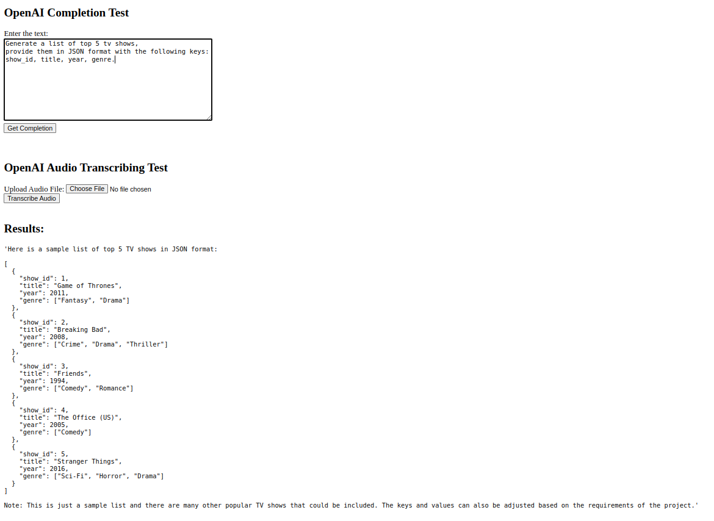

Simple App for testing OpenAI PHP Client

## Requirements

- PHP 8.1 or higher
- Composer 2.2 or higher

## Installation

1. Clone the repository and install dependencies:
```
git clone https://github.com/say-my-name-user/openai-php-client.git
cd openai-php-client
composer install
```
2. Create `.env` file from `.env.example` in the root directory and add your OpenAI API key
3. Run the server:
```
php -S localhost:8000 -t pub
```
4. See the result in your browser: http://localhost:8000:

